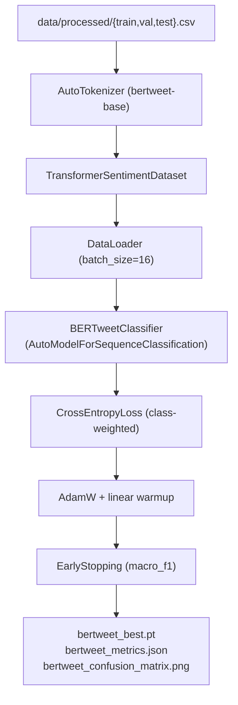

# M4 — BERTweet Fine-tuning: Technical Design & Architecture

## System Overview

M4 fine-tunes `vinai/bertweet-base` for 7-class mental health sentiment analysis. It reuses the shared preprocessing pipeline from M2 and the shared metrics/utils from M3, adding a HuggingFace-native data layer and a Transformer-aware training loop.

## Architecture Overview

## Design Decisions

### Decision 1: HuggingFace `AutoModelForSequenceClassification`
- **Problem**: Managing custom classification heads on top of BERTweet manually is error-prone.
- **Decision**: Wrap `AutoModelForSequenceClassification` with `ignore_mismatched_sizes=True` so the pre-trained model's lm-head is replaced by a fresh 7-class linear head.
- **Rationale**: Single-call fine-tuning; head-only training also possible via `freeze_base` flag.
- **Trade-offs**: Slightly larger checkpoint (~500 MB vs ~50 MB for BiLSTM).

### Decision 2: Gradient Accumulation + Optional AMP
- **Problem**: 16-sample batches on 8 GB GPU fine, but effective batch size should be 32.
- **Decision**: `gradient_accumulation_steps: 2`; optional `fp16: true` flag (disabled by default for CPU safety).
- **Trade-offs**: Slightly more complex training loop; fp16 disabled keeps defaults reproducible on CPU.

### Decision 3: Reuse `EarlyStopping` from `src/training/trainer.py`
- **Decision**: Import `EarlyStopping(mode="max", patience=3)` monitoring `macro_f1`.
- **Rationale**: Consistency with M3; same stopping criterion enables fair comparison.

## Data Models

| Stage | Format | Schema |
|-------|--------|--------|
| Input | CSV | `text` (str), `label` (str), `label_id` (int) |
| Tokenized | Dict tensors | `input_ids`, `attention_mask`, `labels` |
| Checkpoint | `.pt` | `{model_state_dict, model_name, num_classes, epoch, best_metric}` |
| Metrics | JSON | `{model, split, accuracy, macro_f1, weighted_f1, per_class, confusion_matrix}` |

## Component Breakdown

- **`src/data/bertweet_dataset.py`**: `TransformerSentimentDataset` + `build_transformer_loaders()` factory.
- **`src/models/bertweet.py`**: `BERTweetClassifier` wrapper; `save_checkpoint` / `from_checkpoint`.
- **`scripts/train_bertweet.py`**: Training orchestration — gradient accumulation, AMP, scheduler, history JSON.
- **`scripts/eval_bertweet.py`**: Checkpoint load → inference → metrics + confusion matrix.

## Non-Functional Requirements

- **GPU OOM**: Reduced by gradient accumulation; `freeze_base: true` option for head-only training.
- **Reproducibility**: `seed: 42` passed to all data loaders and model init.
- **Tokenizer `max_len: 128`**: Covers 95th-percentile text token length; truncates longer texts.
