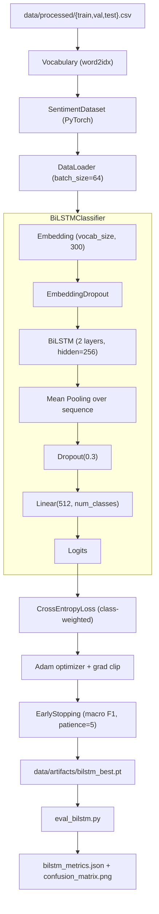

# Design — BiLSTM Baseline (M3)

## Architecture Overview

## Data Models

| Artifact | Shape / Type | Description |
|---|---|---|
| `vocab.json` | `{word: idx}` | Word-to-index mapping |
| Model input | `(batch, seq_len=128)` | Long tensor of token ids |
| Model output | `(batch, num_classes)` | Raw logits |
| Checkpoint | `.pt` file | `state_dict` of best epoch |
| Metrics | JSON per `data_contract.md §7` | Evaluation report |

## Component Breakdown

| Module | Responsibility |
|---|---|
| `src/models/bilstm.py` | `BiLSTMClassifier` with optional GloVe loader |
| `src/data/dataset.py` | `Vocabulary`, `SentimentDataset`, dataloaders factory |
| `src/training/trainer.py` | `train()` loop, `EarlyStopping`, `_train_epoch`, `_eval_epoch` |
| `src/utils/metrics.py` | `compute_metrics()`, `save_metrics()`, confusion matrix plot |
| `scripts/train_bilstm.py` | CLI: build vocab → build model → train → save checkpoint |
| `scripts/eval_bilstm.py` | CLI: load checkpoint → evaluate → save metrics + plot |
| `configs/bilstm.yaml` | All hyperparameters |

## Design Decisions

1. **Mean-pooling over LSTM outputs** — more robust than last-hidden on variable-length text.
2. **Class-weighted loss (default on)** — addresses label imbalance without augmentation.
3. **Early stopping on macro F1** — avoids optimising for majority class.
4. **Gradient clipping (norm=5)** — prevents exploding gradients in deep LSTM.
5. **Vocabulary saved separately** — enables consistent encoding between train and inference.
6. **Optional GloVe embeddings** — pluggable; random init is the default for fast baseline.

## Non-Functional Requirements

- Target accuracy: 75–80% on test split (subject to data quality).
- Training time: < 2 hours on CPU with early stopping.
- Fully reproducible from documented commands with seed=42.
- No external API dependency (self-contained).

