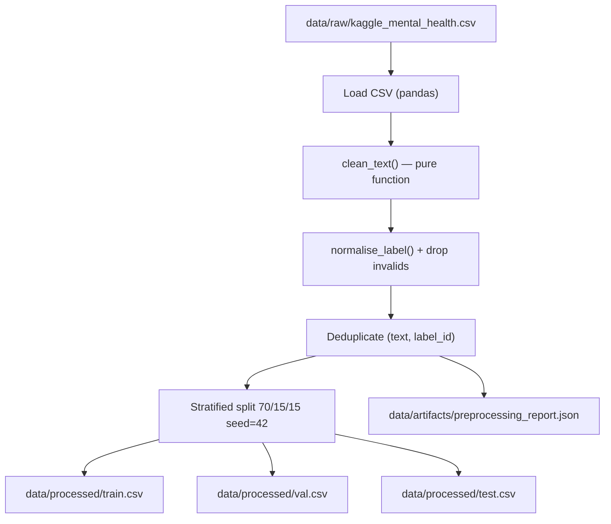

# Design — Dataset Preprocessing (M2)

## Architecture Overview

## Data Models

### Raw input
| Column | Type | Example |
|---|---|---|
| `text` | str | `"I can't sleep, everything feels hopeless"` |
| `label` | str | `"depression"` |

### Processed output
| Column | Type | Example |
|---|---|---|
| `text` | str | `"i can't sleep everything feels hopeless"` |
| `label` | str | `"depression"` |
| `label_id` | int | `1` |

## Component Breakdown

| Module | Responsibility |
|---|---|
| `src/data/preprocess.py` | `clean_text()`, `normalise_label()`, `preprocess_dataframe()`, `validate_processed_csv()` |
| `src/data/dataset.py` | `Vocabulary`, `SentimentDataset`, `build_vocab_and_loaders()`, `compute_class_weights()` |
| `scripts/preprocess.py` | CLI entry-point: load config → run pipeline → save splits + report |
| `configs/preprocessing.yaml` | All configurable parameters (paths, split ratios, label map, seed) |

## Design Decisions

1. **Pure functions for cleaning** — no side effects, fully deterministic and testable.
2. **Label map in config** — easy to extend without touching source code.
3. **Stratified split** — preserves class distribution across all three splits.
4. **Deduplication by (text, label_id)** — prevents data leakage from repeated posts.
5. **Quality report JSON** — provides audit trail for reviewers and CI validation.

## Non-Functional Requirements

- Deterministic: same raw CSV always produces identical split files.
- Fast: full pipeline runs in < 5 minutes on local CPU (baseline dataset).
- Observable: all dropped rows are counted and categorised in the quality report.

