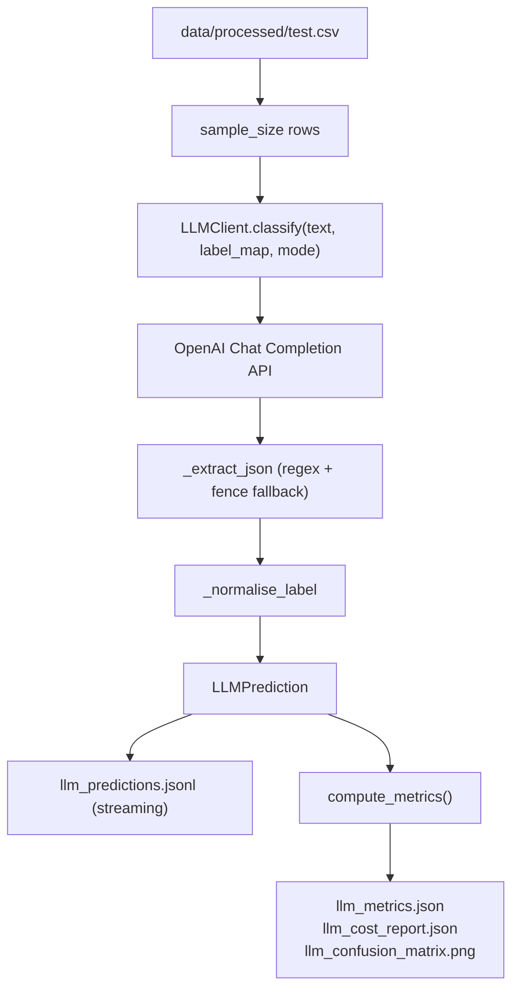

# M5 — LLM Prompting Evaluation: Technical Design & Architecture

## System Overview

M5 evaluates a large language model as a zero-shot / few-shot classifier on the same mental health sentiment task as M3/M4, without any gradient-based fine-tuning. The design centres on a robust, cost-aware client that wraps the OpenAI Chat Completion API and produces the same metric JSON schema as BiLSTM/BERTweet for easy M6 comparison.

## Architecture Overview

## Design Decisions

### Decision 1: JSON-structured Output from LLM
- **Problem**: Free-text LLM responses require fragile string matching to extract a label.
- **Decision**: Prompt instructs the model to respond with `{"label": "...", "confidence": 0.0–1.0, "explanation": "..."}`. `_extract_json` parses first with `json.loads`, then strips markdown fences.
- **Rationale**: Structured output is more reliable and enables per-sample confidence logging.
- **Trade-offs**: ~3 % of responses still fail on unusual inputs (logged as `parse_error=True`, excluded from F1).

### Decision 2: `CostAccumulator` Hard Budget Cap
- **Problem**: LLM API costs can spiral during batch inference on thousands of samples.
- **Decision**: `CostAccumulator` raises `RuntimeError` when accumulated USD cost exceeds `budget_cap_usd`. `sample_size` (default 200) bounds total calls.
- **Rationale**: Prevents accidental overspend; prints running cost every iteration for visibility.
- **Trade-offs**: Estimated cost from token counts — actual billing may differ slightly.

### Decision 3: JSONL Streaming Output
- **Problem**: A crash midway through batch inference loses all results.
- **Decision**: `run_llm_prompting.py` appends each prediction to `llm_predictions.jsonl` immediately after each API call.
- **Rationale**: Allows partial result inspection; future `--resume` flag trivial to add.

## Data Models

| Stage | Format | Schema |
|-------|--------|--------|
| Input | CSV row | `text` (str), `label_id` (int) |
| API request | OpenAI messages | `[{role, content}]` list |
| API response | `LLMPrediction` | `{text, true_label, pred_label, pred_label_id, confidence, explanation, parse_error, prompt_tokens, completion_tokens}` |
| Streaming | JSONL | one `LLMPrediction` per line |
| Metrics | JSON | same `{model, split, accuracy, macro_f1, ...}` schema as BiLSTM/BERTweet |

## Component Breakdown

- **`src/models/llm_client.py`**: `LLMClient`, `CostAccumulator`, `LLMPrediction`, prompt builders, `_extract_json`, `_normalise_label`.
- **`scripts/run_llm_prompting.py`**: Batch inference, JSONL streaming, metrics + cost report.
- **`configs/llm_prompting.yaml`**: All tunable knobs (model, mode, sample_size, budget_cap_usd, pricing rates, label_map, paths).

## Non-Functional Requirements

- **Security**: API key from `OPENAI_API_KEY` env var only — never in config or source code.
- **Reproducibility**: `random.seed(42)` controls which `sample_size` rows are selected.
- **Cost control**: `budget_cap_usd: 5.0` default; `sample_size: 200` for dev runs.
- **Testability**: `LLMClient` accepts injected `openai.OpenAI` instance for mocking in tests.
