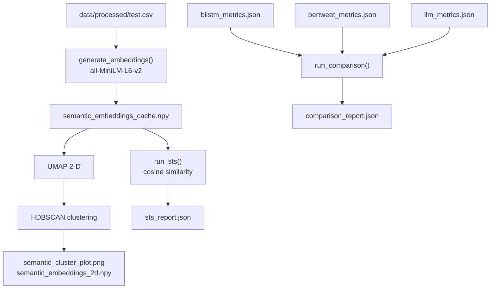

# M6 — Semantic Evaluation Suite: Technical Design & Architecture

## System Overview

M6 provides three orthogonal lenses on the mental health dataset and model outputs:
1. **STS scoring** — semantic textual similarity within vs across classes.
2. **Embedding clustering** — UMAP + HDBSCAN to discover structure in the embedding space.
3. **Cross-model comparison** — unified leaderboard from M3/M4/M5 metric JSONs.

## Architecture Overview

## Design Decisions

### Decision 1: `.npy` Embedding Cache
- **Problem**: Encoding 7 500+ test-set rows with `all-MiniLM-L6-v2` takes ~60 s on CPU.
- **Decision**: `generate_embeddings()` checks for a cached `.npy` file; writes it on first run and reloads on subsequent runs.
- **Rationale**: Enables fast iteration on STS / clustering params without re-encoding.
- **Trade-offs**: Cache must be deleted when model or dataset changes.

### Decision 2: UMAP → HDBSCAN Pipeline
- **Problem**: HDBSCAN on raw 384-D embeddings is slow and noise-sensitive.
- **Decision**: Reduce to 2-D with UMAP first (`n_components=2`, `metric=cosine`), then cluster with HDBSCAN (`min_cluster_size=30`). `random_state=42` pinned.
- **Trade-offs**: Information loss from dimensionality reduction; 2-D also enables direct visualisation.

### Decision 3: `--skip-*` CLI Flags
- **Problem**: During development it is useful to re-run only one sub-module.
- **Decision**: `argparse` flags `--skip-sts`, `--skip-cluster`, `--skip-comparison` bypass respective routines.

## Data Models

| Stage | Format | Schema |
|-------|--------|--------|
| Input | CSV | `text` (str), `label_id` (int) |
| Embeddings | ndarray | `(N, 384)` float32 |
| 2-D projection | ndarray | `(N, 2)` float32 |
| STS report | JSON | `{within_class: {label: float}, cross_class: {label×label: float}}` |
| Comparison | JSON | `[{model, accuracy, macro_f1, weighted_f1}, ...]` sorted desc by `macro_f1` |

## Component Breakdown

- **`generate_embeddings(texts, model_name, cache_path)`**: Encode or reload; returns `np.ndarray (N, D)`.
- **`run_sts(embeddings, labels, id_to_label)`**: Per-class and cross-class cosine similarity; writes `sts_report.json`.
- **`run_clustering(embeddings, labels, umap_cfg, hdbscan_cfg, out_dir)`**: UMAP + HDBSCAN; saves 2-panel figure.
- **`run_comparison(metric_paths, out_path)`**: Loads metric JSONs, builds leaderboard; graceful for missing files.

## Non-Functional Requirements

- **Optional deps**: `umap` and `hdbscan` imported lazily with `ImportError` guard and an actionable message.
- **Reproducibility**: `random_state=42` in UMAP; all random ops seeded.
- **Memory**: UMAP on 7 500 × 384 requires ~4 GB RAM; not suitable for <4 GB environments without sampling.
